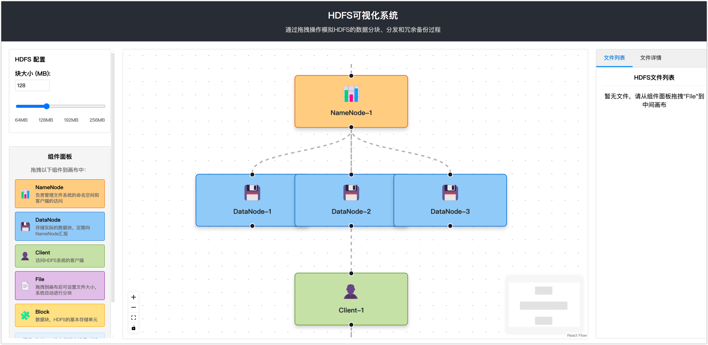

# HDFS-Visualization

Hadoop文件系统（HDFS）可视化界面，帮助教学工作和理解 HDFS 原理的工具！

> 🌐 [在线预览](https://hdfs-visualization-gzuiyxyie-rroranges-projects-66724dcf.vercel.app/)

## 具体操作页面

## 开发流程

1. clone 项目

> git clone https://github.com/zhiyu1998/HDFS-Visualization.git

2. 安装项目

> npm install

3. 启动项目

> npm run start